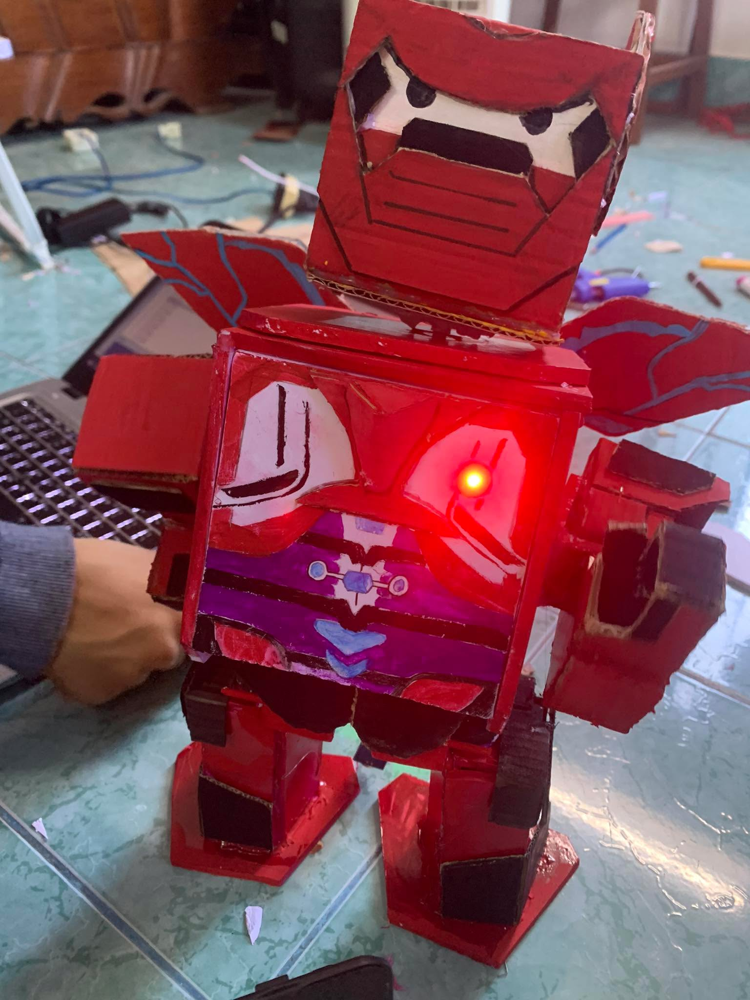

# 🤖 Dancing Robot Arduino

A dancing robot built with **Arduino Uno R3** using Object-Oriented Programming (OOP) in C++.  
The robot reacts to sound and performs random dance animations using five servo motors.

---


<p align="center">
  
</p>

<p align="center">
DIY Arduino humanoid robot that reacts to sound and performs multiple dance animations using five servo motors.
</p>

## 📌 Features

- Object-Oriented Programming (OOP)
- Smooth servo movement
- Sound activated dancing
- 10 different dance routines
- Modular project structure
- Easy to add new motions
- Easy to modify servo angles
- LED chest indicator

---

## 🛠 Hardware

| Component | Quantity |
|-----------|---------:|
| Arduino Uno R3 | 1 |
| SG90 Servo Motor | 5 |
| Sound Sensor (KY-037/KY-038) | 1 |
| LED | 1 |
| 220Ω Resistor | 1 |
| Breadboard | 1 |
| Jumper Wires | Several |
| External 5V Power Supply (Recommended) | 1 |

---

## 🔌 Pin Configuration

| Device | Pin |
|---------|----:|
| Head Servo | D3 |
| Left Arm Servo | D5 |
| Right Arm Servo | D6 |
| Left Wing Servo | D9 |
| Right Wing Servo | D10 |
| Chest LED | D11 |
| Sound Sensor | D2 |

---

## 📂 Project Structure

```
RobotDance/
│
├── RobotDance.ino
│
├── Config.h
│
├── ServoController.h
├── ServoController.cpp
│
├── Effects.h
├── Effects.cpp
│
├── Robot.h
├── Robot.cpp
│
├── README.md
│
└── .gitignore
```

---

## 🧠 Software Architecture

```
Robot
│
├── ServoController
│      ├── Head
│      ├── Left Arm
│      ├── Right Arm
│      ├── Left Wing
│      └── Right Wing
│
├── Effects
│      └── LED
│
└── Behaviors
       ├── Startup
       ├── Greeting
       ├── Idle
       └── Dance
```

---

## 🎮 Robot Actions

### Head

- Look Left
- Look Right
- Look Center
- Nod
- Shake

### Arms

- Raise Arms
- Lower Arms
- Wave Left Hand
- Wave Right Hand
- Wave Both Hands

### Wings

- Open Wings
- Close Wings
- Flap Wings

### Full Body

- Ready Pose
- Celebrate
- Center All

---

## 💃 Dance Library

The robot includes ten dance routines.

- Dance 1
- Dance 2
- Dance 3
- Dance 4
- Dance 5
- Dance 6
- Dance 7
- Dance 8
- Dance 9
- Dance 10

Each dance is composed of reusable robot actions.

---

## 🚀 Getting Started

1. Clone this repository

```
git clone https://github.com/yourusername/DancingRobot.git
```

2. Open **RobotDance.ino** using Arduino IDE.

3. Select

```
Board:
Arduino Uno
```

4. Select the correct COM Port.

5. Upload the sketch.

6. Power the robot.

---

## 🎵 How It Works

1. Robot powers on.
2. Startup animation begins.
3. Robot waits for sound.
4. Sound is detected.
5. A random dance is selected.
6. Robot returns to idle mode.

---

## ⚙ Configuration

All servo angles and pin definitions can be modified inside:

```
Config.h
```

This file contains:

- Pin assignments
- Servo limits
- Center positions
- Motion delay
- Sound trigger configuration

---

## 📷 Demonstration

Example robot configuration:

- 1 Head Servo
- 2 Arm Servos
- 2 Wing Servos
- 1 Chest LED

---

## 📈 Future Improvements

- Bluetooth control
- Mobile App
- OLED display
- RGB LED effects
- MP3 music module
- Ultrasonic obstacle detection
- Gesture control
- Voice commands

---

## 👨‍💻 Author

**Lê Hữu Đức**

University of Industry and Trade Ho Chi Minh City

Faculty of Information Technology

---

## 📜 License

This project is released under the MIT License.

Feel free to use, modify, and improve it.
